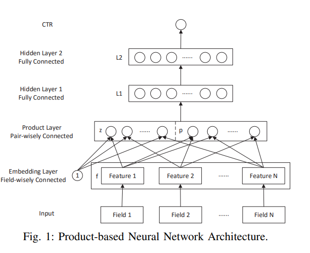

# Predicting Clicks
### A survey of different click-prediction datasets with various ml methods

Predicting clicks is hugely important to today's web. Anything personalized such as recommendations, search results or dynamic ads can be driven with a click-prediction model. Still its not a simple problem to crack. The relative quality of the model is not trivial. Over millions of impressions a company has a lot to gain from a slight improvement in their probability of click prediction. 

## Project Outline

## Key Concepts

### Product Neural Networks
*Product* here refers to the mathematical product of two vectors, not the 'products' whose clicks are being predicted!

Product-based neural networks (PNNs) are defined as having a layer immediately after an embedding layer which uses pairwise products between embedded features. The pairwise products can either be inner products resulting in a scaler or outer products resulting in a matrix. The logic behind using pairwise products to better learn interactions is to learn weights and biases that treat individual feature embeddings with an AND operator rather than OR operator as they do in plain linear signal. 

The embedding layer does not use a pre-trained Factorization Machine. The model learns each layer from scratch. 

#### Papers List
1. [Product-Based Neural Networks For User Response Prediction](https://arxiv.org/pdf/1611.00144v1.pdf)
2. [Factorization Machines] (https://cseweb.ucsd.edu/classes/fa17/cse291-b/reading/Rendle2010FM.pdf)
3. [Matrix Factorization Graphic] (https://developers.google.com/machine-learning/recommendation/collaborative/matrix)
4. [Neural Factorization Machines] (https://arxiv.org/pdf/1708.05027.pdf)

### Self Attention

#### Papers List
1. [Attention is all you need](https://arxiv.org/pdf/1706.03762.pdf)

### Instance Masks

### Graph Neural Networks

### Network Normalization

### Interactions
Capturing Higher-order interaction effects are crucial to predicting CTR or click-through rate. 

#### Papers List
1. [Detecting Statistical Interactions From Neural Network Weights](https://openreview.net/pdf?id=ByOfBggRZ)

### Resources

1. https://paperswithcode.com/task/click-through-rate-prediction
2. https://christophm.github.io/interpretable-ml-book/interaction.html
3. https://www.kaggle.com/hughhuyton/criteo-uplift-modelling#Uplift-Modelling

### Data Sources

1. Expedia Hotels https://www.kaggle.com/c/expedia-hotel-recommendations
2. Avito Context https://www.kaggle.com/c/avito-context-ad-clicks/data
3. Criteo https://www.kaggle.com/c/criteo-display-ad-challenge/data
4. Avazu https://www.kaggle.com/c/avazu-ctr-prediction/data
4. iPinYou https://github.com/Atomu2014/make-ipinyou-data

